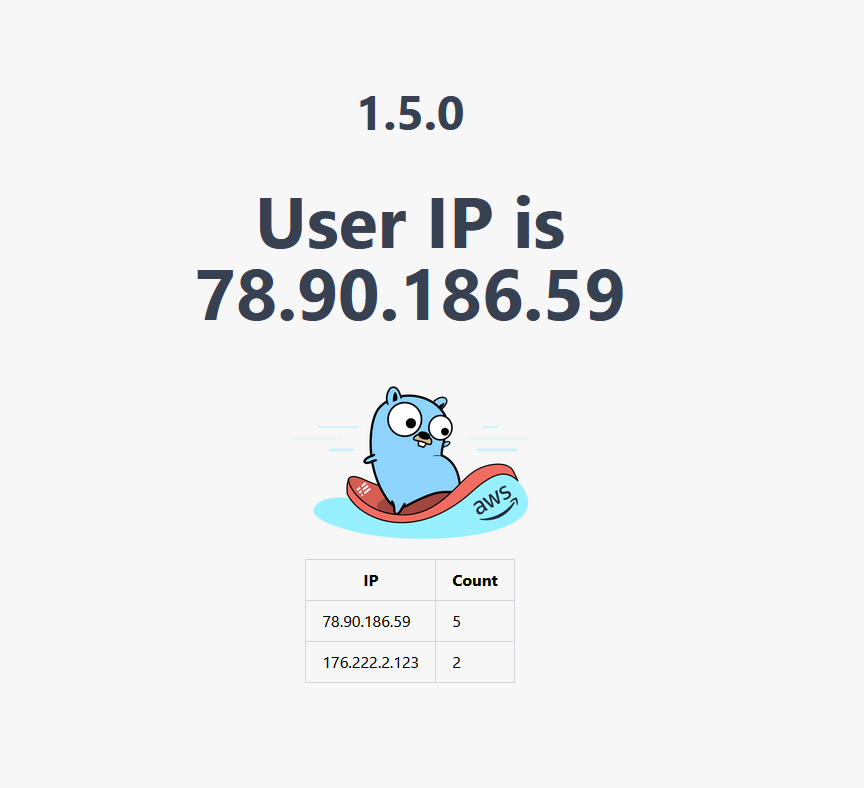

# GHTMX

### 1. Въведение
GHTMX е малко уеб проложение, което показва вашето публично IP и статистика за топ 10 IP-та които са посещавали сайта. 



### 2. Изпозвани технолоии

- Backend & Frontend (Server-Side-Rendering):
    - Go
    - HTMX
    - PostgreSQL
    - Docker
- Инфраструктура (AWS):
    - 1x S3 (Terraform Remote Backend, tfstate) 
    - 1x VPC (CIDR 10.0.0.0/16)
    - 1x Internet Gateway
    - 1x Route Table
    - 3x Subnets
        - 1x Public (CIDR 10.0.1.0/24) 
        - 2x Private (CIDR 10.0.2.0/24, 10.0.3.0/24) 
    - 1x EC2
    - 1x RDS
    - 1x DynamoDB
    - 1x VPC Flow Logs
    - 1x CloudWatch Logs
- CI/CD:
    - Github Actions
    - Github Container Registry (test images)
    - Docker Hub (prod images)
    - Docker Swarm
    - AWS SSM

### 3. Инфраструктура


<mark>Security group-ите на public & private subnets са нарочно направени да приемат всяко IP и всеки порт, заради проблем с AWS SSM на CI/CD-то.</mark>

За този проект избрах да използвам 2-tier архитектура, заради по-лесната конфигурация на CI/CD пайплайна, понеже нашата апликация може да се достъпи дирекно чрез публично IP и не трябва да се минава през Load Balancer и Nat Gateway.

В Public Subnet-a се намира една EC2 инстанция, на която е деплойнат апликейшънът. При създавяне на инстанцията се пуска и следния скрипт, който:
- изтегля postgre cli (изполва се замо за по-лесно дебъгване)
- изтегля Docker
- активира Docker Swarm
- стартира нашата апликация на Docker Swarm

```bash
#!/bin/bash

sudo apt-get update
sudo apt install postresql-client

curl -fsSl https://get.docker.com -o docker-init.sh
sh docker-init.sh

sudo docker swarm init
sudo docker service create --name ghtmx --network host iypetrov/ghtmx:latest
```

За тази апликация избрах да ползвам Docker Swarm като оркестратор на приложението, защото:
- ползвайки оркестратор, апликацията не ще бъде available дори когато се има деплой
- доста лек оркестратор
- не изисква допълнителна конфигурация, след като сме изтеглили Docker, защото Docker Swarm е вграден във Docker, но не е активиран по подразбиране

В Private Subnet-a се напира RDS (PostgreSQL), където държим IP-тата на потребителите, които са достъпили апликацията.

В тази конфигурация обаче има един проблем. За да стартираме апликацията, ни е нужен адреса, на който базата ще стартира. Понеже не можем да дадем тази информация директно на ec2-та ни, създавеме DynamoDB инстанция, където съхраняваме endpoint-a на който е стартирала базата ни. По този начин в CI/CD пайплаина ни преди да стартираме апликейшъна ни взимаме този ендпойнт от DynamoDB-то.

### 3. CI/CD

CI частта не засяга инфраструктурния аспект напроекта, затова няма да я описвам.

CD частта се дели на тре стъпки:
- Kaчване на имидж на полседната версия на нашата апликация в Docker Hub
- Промяна на ресурсите в AWS, ако има промени
```bash
cd infr/terraform
terraform init -input=false
terraform plan -input=false -compact-warnings -var="db_username=${DB_USERNAME}" -var="db_password=${DB_PASSWORD}"
terraform apply -input=false -compact-warnings -auto-approve -var="db_username=${DB_USERNAME}" -var="db_password=${DB_PASSWORD}"
```
- Качваме последната версия на апликацията на Docker Swarm-a
```bash
db_addr="$(aws dynamodb get-item --table-name db-config --key '{"DefaultKey": {"S": "STORAGE_ADDR"}}' | jq -r '.Item.Endpoint.S')"
echo "db endpoint is ${db_addr}"
cmd="touch /tmp/ghtmx && echo ${db_addr} > /tmp/ghtmx && \
        command -v docker > /dev/null && \
        sudo docker pull iypetrov/ghtmx:latest && \
        sudo docker service update --image iypetrov/ghtmx:latest --env-add STORAGE_ADDR=\$(cat /tmp/ghtmx) --env-add STORAGE_USERNAME=\$(echo ${DB_USERNAME}) --env-add STORAGE_PASSWORD=\$(echo ${DB_PASSWORD}) ghtmx"
while read instance_id; do
    aws ssm send-command \
        --instance-ids "${instance_id}" \
        --document-name "AWS-RunShellScript" \
        --parameters commands="${cmd}"
    echo "instance -> ${instance_id}"
done < <(aws ec2 describe-instances \
            --query "Reservations[*].Instances[*].InstanceId" \
            --filters Name=instance-state-name,Values=running \
            --output text)
```
Тук на всяка наша ec2 инстанция пращаме команда да вземе последната версия на нашата апликация и да почне да сервира нея.

### 4. Monitoring

За да следим трафика в нашето VPC изполвах VPC Flow Logs, за да събирам метриките и ги пращам към CLoudWatch Logs.


Също така изпозвам следната филтрация по подразбиране:
```
fields @timestamp, srcAddr, srcPort, dstAddr, dstPort, bytes
```

## Ресурси:
https://www.youtube.com/watch?v=7xngnjfIlK4&t=4099s

https://registry.terraform.io/providers/hashicorp/aws/latest/docs

https://www.udemy.com/course/aws-certified-solutions-architect-associate-saa-c03/?couponCode=ST2MT43024